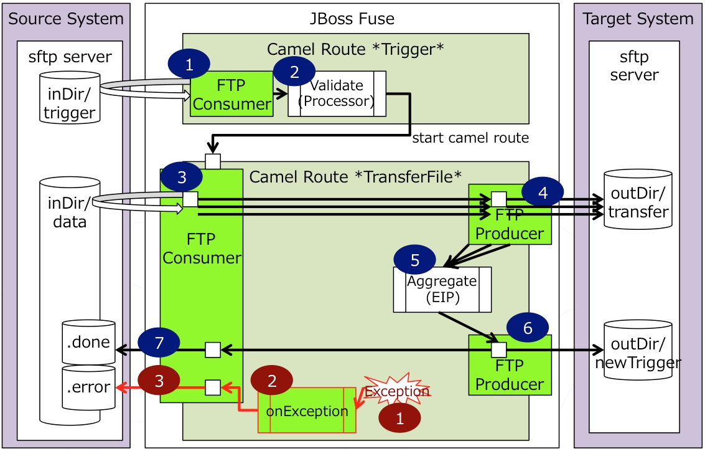
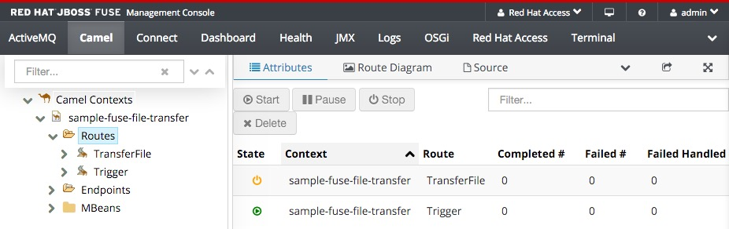
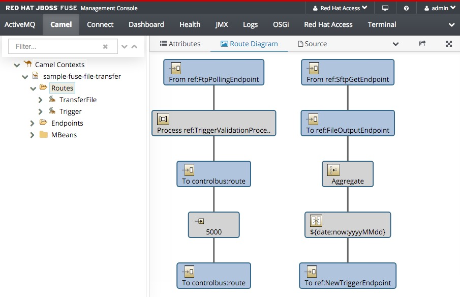
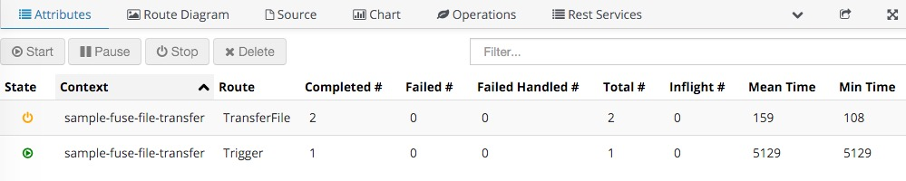
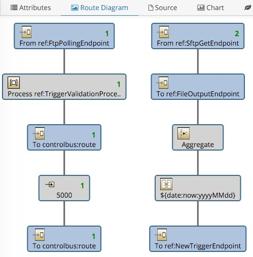

JBoss fuse-file-transfer-hub-demo Quickstart Guide
============================================================
This Demo is based on [JBoss Fuse](http://www.jboss.org/products/fuse) product.
In this Demo, you will learn how to use JBoss Fuse as file transfer hub.

>NOTE: Details of implementation can be found in [HERE](./projects/sample-fuse-file-transfer/README.md)


HIGHLIGHTS
- Integration triggered by trigger file on remote SFTP Server
- Transfer multiple files then create a new trigger file to notify target system that data file are ready
- Using camel-sftp and and local work dir to avoid overhead for big size file
- Using JBoss Fuse BOM in pom.xml, so that easy to migrate new version of fuse
- Divided customer configuration in perperties.xml, so that easy to modify
- Separate definition portion of Endpoint in CamelRoute.xml, so that simplified route definition part


INTEGRATION OVERVIEW


- Camel Route *Trigger* monitors file “test.trg” is created in “inDir/trigger”. If file exists, read file content and validate that file body is same as System date in format “YYYYMMDD”. Then start another camel route *TransferFile* to do real transfer of data files.
- Camel Route *TransferFile* pulls all data files in “inDir/data” and sftp them one by one into “outDir/transfer”. Aggregator will wait all files are transferred finished, then create a new trigger file to notify target system that data has been transferred. 


System requirements
-----------------------

Before building and running this quick start you need:
- JDK 1.7 or 1.8
- [Maven 3.x.x](https://maven.apache.org/download.cgi) 
- [JBoss Fuse 6.2.1](http://www.jboss.org/products/fuse/download/)


Setup and Configuration
-----------------------

>NOTE: A step by step instruction can be found in [setup.md](./docs/setup.md)

1. Download this project and unzip OR git clone this onto your desktop
2. Download JBoss Fuse and copy to installs directory
3. setup sftp access, update these login information in sample project
4. Run 'init.sh'
5. Login to Fuse management console at: http://localhost:8181 (u:admin/p:admin)
  Under "Camel" tab, you will find "Trigger" is started and "TransferFile" is waiting.
  
  
  


Enjoy the demo!


Demo Scenario
-----------------------

Prepare test data on sftp server like below to kick start

```sh
ssh test@localhost
mkdir -p inDir/data
mkdir -p inDir/trigger
echo test1 > inDir/data/file1.dat
echo test2 > inDir/data/file2.dat
echo `date '+%Y%m%d'` > inDir/trigger/test.trg
```	

Confirm the result

```sh
ssh test@localhost
tree -a inDir/
tree -a outDir/
```	

Sample result before file transfer
```sh
MBP-jfeng:~ test$ tree -a inDir/
inDir/
├── data
│   ├── .done
│   ├── .error
│   ├── file1.dat
│   └── file2.dat
└── trigger
    └── test.trg
```

Sample result after file transfer
```sh
MBP-jfeng:~ test$ tree -a inDir/
inDir/
├── data
│   ├── .done
│   │   ├── file1.dat
│   │   └── file2.dat
│   ├── .error
└── trigger

MBP-jfeng:~ test$ tree -a outDir/
outDir/
├── newTrigger
│   └── newTrigger-20160119-134537.552.trg
└── transferedData
    ├── file1.dat.20160119-134537.227
    └── file2.dat.20160119-134537.445
```

> NOTE: If any error occurred, the original files will be moved to inDir/data/.error


Login to Fuse management console at http://localhost:8181 (u:admin/p:admin)
Under "Camel" tab, you will find "Trigger" executed 1 time and "TransferFile" executed 2 times.





Shutdown the demo
-----------------------

If you just want to stop the JBoss FUSE Server, run
```sh
./target/jboss-fuse-6.2.1.redhat-084/bin/stop
```

Uninstall/Reset the demo
-----------------------
Once you are done, to stop and clean everything run
```sh
./clean.sh
```

To reset demo from beginning run 
```sh
./clean.sh
./init.sh
```
